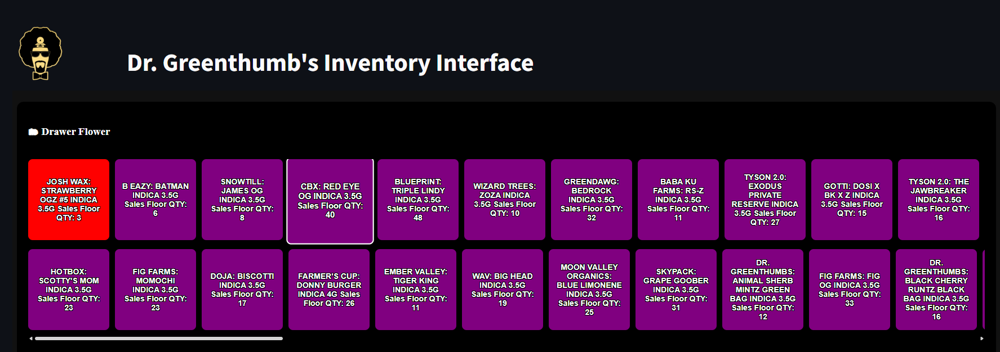
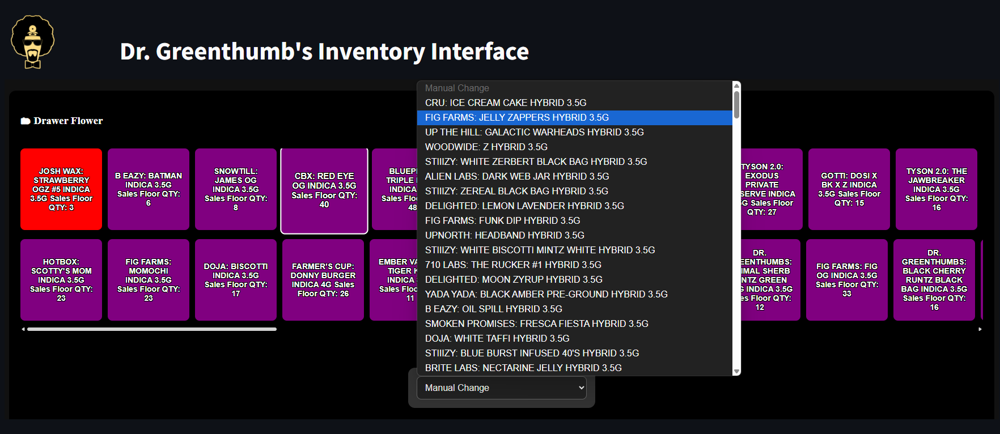
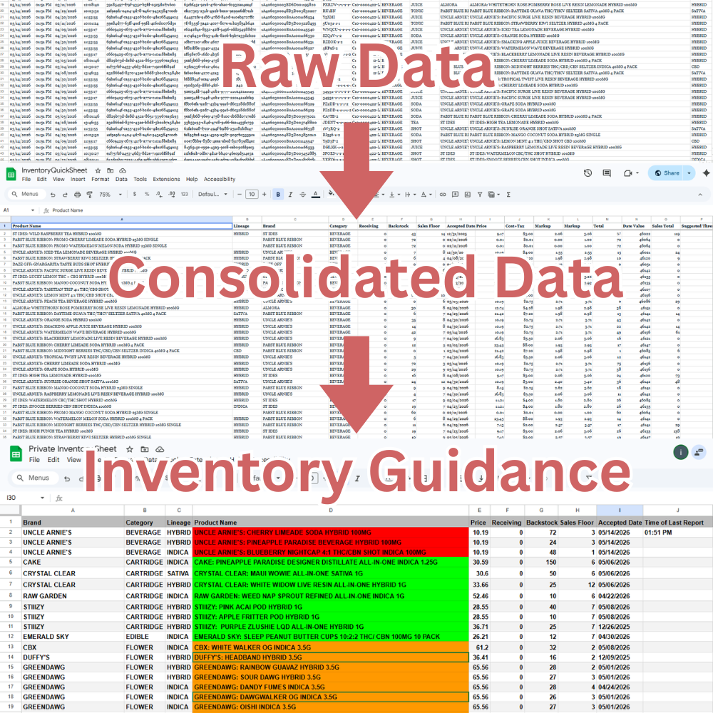
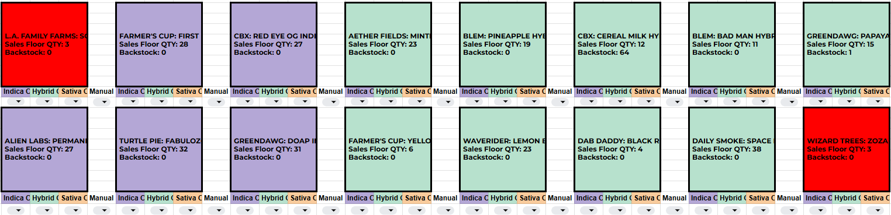
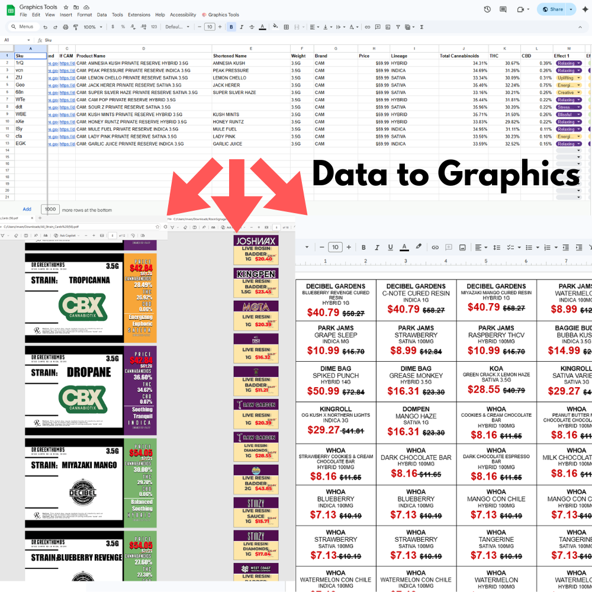
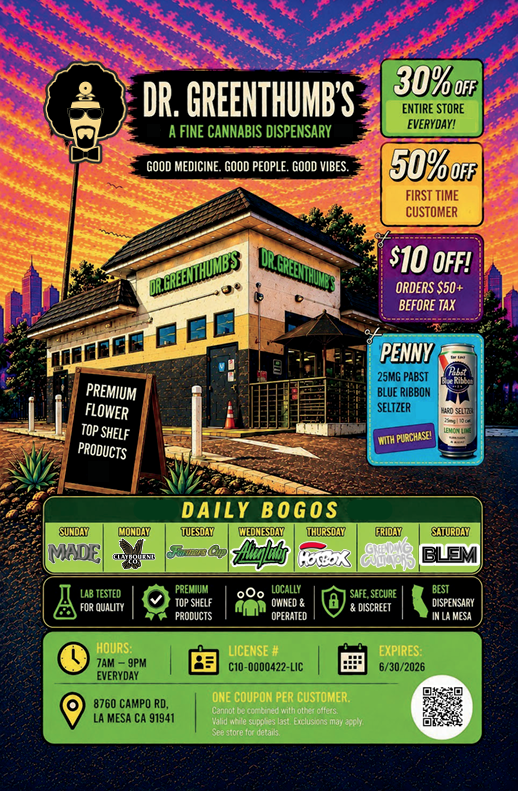

# Automation Portfolio
A collection of workflow automation, inventory operations, reporting, and content generation tools I designed and built for retail and operational environments.

These projects were created to reduce repetitive administrative work, improve inventory accuracy, streamline intake and labeling workflows, and provide scalable operational tooling using low-code and scripting platforms.

The systems in this repository primarily utilize:

- Google Sheets
- Google Apps Script
- Power Automate Desktop
- Python
- Selenium / BeautifulSoup
- OCR processing
- CSV automation pipelines
- Autocrat document generation

---

# Featured Projects

## 📦 DGT Inventory App



An automated inventory synchronization and monitoring system designed to replace repetitive manual inventory workflows.

### What It Does
- Logs into a POS portal automatically
- Downloads live inventory CSV exports
- Replaces source datasets in Google Sheets
- Cleans and restructures data automatically
- Generates filtered inventory views for operational teams

### Key Features
- Automated CSV ingestion
- QUERY-based inventory dashboards
- Dynamic low-stock monitoring
- Product category threshold logic
- Keyword-based conditional inventory alerts

### Example Logic
Different product categories use different inventory thresholds:

- Flower < 20 units
- Edibles < 8 units
- Cartridge products monitored separately
- Brand-specific conditions for vendors like STIIIZY and Puffco

### Technologies Used
- Power Automate Desktop
- Google Sheets
- Google Apps Script
- Advanced spreadsheet formulas

---

# 📊 Inventory Guidance & Restock Intelligence System




A spreadsheet-driven operational inventory platform I designed to transform raw POS exports into actionable restock guidance, sales floor management tools, and real-time inventory visibility systems.

### Core Features
- Automated inventory consolidation
- Dynamic restock guidance generation
- Category and brand-specific threshold logic
- “Not On Floor” product availability tracking
- Priority processing guidance
- Oldest inventory surfacing
- Visual sales floor drawer management

### Advanced Query Architecture
One of the core systems powering the project is a highly customized Google Sheets QUERY engine containing deeply nested business logic for:
- Category-aware inventory thresholds
- Brand-specific stock rules
- Package-type differentiation
- Automated filtering and prioritization
- Dynamic restock generation

The logic evaluates inventory differently depending on:
- Product category
- Brand
- Hardware type
- Package size
- Product format
- Sales behavior

### Visual Drawer Management GUI
The project also includes a visual spreadsheet-based GUI used to manage 94 physical product drawers on the sales floor.

Each drawer dynamically displays:
- Assigned product
- Current quantity
- Inventory status
- Color-coded threshold indicators

The interface includes intelligent dropdown systems allowing staff to:
- View available replacement inventory
- Filter by Indica / Hybrid / Sativa
- Replace products dynamically
- Prevent duplicate floor assignments
- Automatically populate updated quantities

### Technologies Used
- Google Sheets
- Advanced QUERY formulas
- Array formulas
- Power Automate Desktop
- CSV automation pipelines
- Spreadsheet engineering
- Workflow automation systems

### Focus Areas
- Operational intelligence
- Inventory workflow optimization
- Retail systems tooling
- Data transformation
- Business-rule automation
- Spreadsheet application architecture
---

# 🎨 Graphics Generators


A suite of automated print and display generation tools built for retail product presentation and compliance workflows.

## Included Generators
- Strain Card Generator
- Preroll Card Generator
- Display Tag Generator

### Features
- SKU-based automated content population
- PDF generation via Autocrat
- Dynamic product formatting
- Automated Google Drive export pipelines
- Retail-ready display formatting

### Use Cases
- Shelf labeling
- Product display cards
- In-store merchandising
- Rapid promotional signage generation

### Technologies Used
- Google Sheets
- Google Apps Script
- Autocrat
- Google Drive API workflows

---

# 🧾 Invoice METRC Extractor


A PDF invoice processing system that extracts compliance and intake data from scanned distributor invoices.

### What It Does
- Reads invoice PDFs
- Performs OCR extraction
- Identifies METRC package numbers
- Extracts distributor information
- Outputs structured CSV data

### Features
- Fuzzy text matching
- OCR cleanup logic
- Batch invoice processing
- Intake workflow acceleration

### Purpose
This tool was designed to significantly reduce manual intake entry and improve consistency during inventory receiving workflows.

### Technologies Used
- Python
- OCR processing
- CSV parsing
- Text normalization logic

---
# 🤖 AI Marketing & Creative Automation

A collection of AI-assisted marketing workflows and creative production systems built to accelerate content generation, advertising production, and campaign iteration.




### Focus Areas
- AI-generated advertising assets
- Prompt engineering systems
- Multi-format content pipelines
- AI video generation workflows
- Social media creative automation
- Brand-consistent asset generation

### Technologies Used
- ChatGPT
- Runway
- Veo
- Photoshop
- AI image/video generation tools

### Key Goals
- Faster campaign iteration
- Consistent visual branding
- Scalable content production
- Cross-platform asset generation
- Workflow-driven creative systems
  
---

# 💰 Competitor Price Scraper

A competitor pricing intelligence tool that scrapes and compares retail pricing across multiple online menus.

### Features
- Automated competitor scraping
- Product normalization
- Weight/category matching
- Brand comparison logic
- Pricing discrepancy detection

### Matching Logic
The system normalizes inconsistent naming conventions such as:
- Cartridge vs Cart
- Weight formatting
- Brand variations
- SKU naming inconsistencies

### Technologies Used
- Python
- Selenium
- BeautifulSoup
- Fuzzy matching libraries

---

# 🏷️ Product Shell Generator

A product standardization and SKU generation tool built to accelerate POS onboarding workflows.

### What It Does
Automatically generates:
- Standardized product names
- SKU structures
- Categorization formatting
- Naming consistency across systems

### Output Example
```
Brand: Strain Name Special Terms Weight Lineage
```

### Purpose
This system reduced repetitive manual product entry and improved downstream consistency for:
- POS systems
- Online menus
- Inventory reporting
- Weedmaps uploads

### Technologies Used
- Google Sheets
- Google Apps Script
- Formula-based normalization systems

---

# ✅ Weedmaps Verified Products

A verification and reconciliation system used to compare in-store products against verified online listings.

### Features
- Product matching
- Brand verification
- Category reconciliation
- Upload assistance workflows
- Listing discrepancy detection

### Purpose
Built to maintain cleaner online product data and reduce listing inconsistencies between internal systems and Weedmaps.

### Technologies Used
- Google Sheets
- Data normalization
- Matching algorithms
- Workflow automation

---

# Technical Focus Areas

Throughout these projects I focused heavily on:

- Workflow automation
- Operational efficiency
- Low-code system architecture
- Data normalization
- Inventory operations
- OCR and document processing
- Automation reliability
- Retail systems integration
- Cross-platform process design

---

# Additional Skills & Technologies

- Power Automate Desktop
- Google Workspace Automation
- Spreadsheet Engineering
- Python Scripting
- Data Cleanup & Structuring
- OCR Processing
- Web Scraping
- Inventory Operations
- Reporting Systems
- Retail Process Automation
- AI-assisted workflow development

---

# About This Repository

Most projects in this repository are sanitized portfolio versions of real-world operational systems I designed and maintained professionally.

Sensitive credentials, proprietary business data, and production-specific integrations have been removed before publishing.


